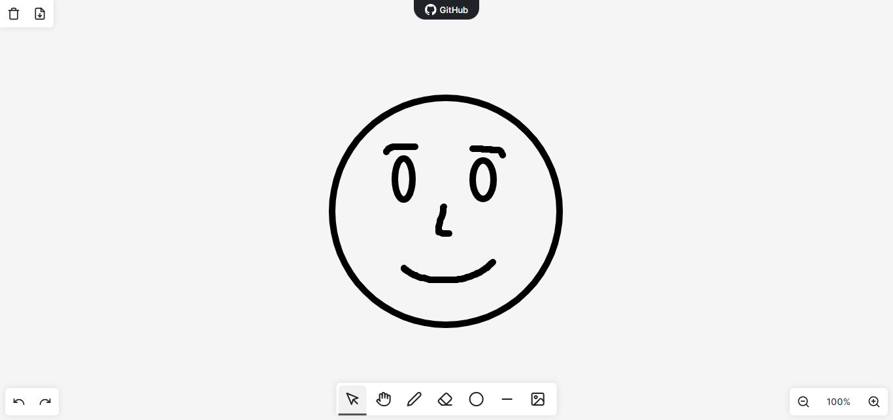

# Draw app

A draw app made with vanilla TypeScript using only Canvas API.

The app is hosted on vercel and can be accessed [here](https://painting-canvas.vercel.app/).

## Features

-   Draw with the mouse
-   Draw shapes like lines, rectangles, and circles
-   Add images to the drawing
-   Export the drawing as an image
-   Undo and redo
-   Clear the canvas
-   Pan though an infinite canvas
-   Easily erase elements of the drawing
-   Zoom in and out
-   Touchpad gestures support
<!-- -   Change the size of the brush
-   Change the color of the brush
-   Change the background color
-   Add text to the drawing
-   Change the font size and color of the text
-   Change the font family of the text
-   Change the alignment of the text
-   Change the style of the text
-   Change the weight of the text -->

## Preview

